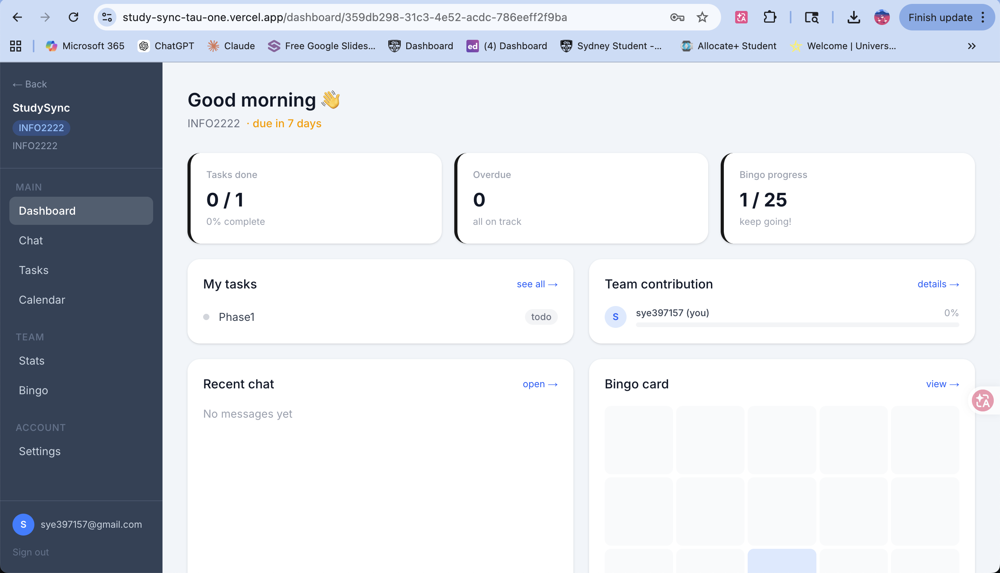

# StudySync

**专为大学小组作业设计的 AI 协作工具。**

> 源自真实痛点：通过对大学生的半结构化访谈，识别出透明度不足、协调困难和搭便车问题。

[English](README.md) | [中文](README.zh.md)

在线演示: [https://study-sync-tau-one.vercel.app](https://study-sync-tau-one.vercel.app)

GitHub: [https://github.com/StellaYe1130/StudySync](https://github.com/StellaYe1130/StudySync)


---

## 演示

> 下方为截图展示，clone 到本地即可体验完整功能。





---

## 系统架构

```
Browser (Next.js App Router)
    │
    ├── Supabase Auth          — 登录 / 会话
    ├── Supabase PostgreSQL    — 项目、任务、消息、成员
    ├── Supabase Realtime      — 基于 WebSockets 的实时聊天
    └── /api 路由 (服务端)
            ├── /api/chat              → Anthropic Claude API
            └── /api/upload-assignment → pdf-parse → Supabase
```

所有数据库访问均由 **行级安全策略 (RLS)** 保护，用户只能读写自己项目内的数据。

---

## 功能

### 团队聊天 + AI 助手
- 基于 Supabase Realtime WebSockets 的实时消息
- 上传作业 PDF，AI 读取内容并针对具体任务回答问题
- 让 AI 拆解需求、总结进度或建议下一步

### 任务看板
- 看板列：待完成 / 进行中 / 已完成 / 阻塞
- 分配任务给指定成员
- 按我的 / 逾期 / 阻塞 / 本周筛选
- 仪表盘与任务页均显示逾期提醒

### 团队贡献统计
- 按成员计算贡献分（已完成任务 × 2 + 消息数 × 0.5）
- 全队贡献条形图

### Bingo 游戏化
- 与真实协作行为绑定的 5×5 宾果卡
- 破冰问题，降低新团队社交摩擦
- 真实行为解锁成就徽章
- 团队里程碑追踪

### 仪表盘总览
- 距截止日期倒计时
- 一览已完成任务、逾期数量、Bingo 进度
- 我的任务预览、团队贡献、最新聊天快照

---

## 关键技术决策

以下是开发中遇到的非平凡问题及解决方案。

**1. Supabase Realtime 过滤订阅**

Supabase 服务端 `postgres_changes` 过滤器（如 `project_id=eq.xxx`）需要表启用 `REPLICA IDENTITY FULL`，默认未开启。我选择移除服务端过滤，改为在客户端回调中过滤，更简洁也更通用。

**2. 聊天的乐观更新**

仅依赖 Realtime 展示发送者自己的消息会有明显延迟。改用乐观更新：发送时立即用 `.insert().select().single()` 返回的行更新本地状态，Realtime 事件到达时按 `id` 去重。

**3. pdf-parse 在 Next.js App Router 中的问题**

`pdf-parse` v2 内部依赖 `pdfjs-dist`，会在运行时加载 Web Worker，导致 Next.js webpack 打包崩溃。在 `next.config.ts` 加一行即可解决：

```ts
serverExternalPackages: ['pdf-parse']
```

让 Next.js 跳过打包、直接在运行时 require。

---

## 技术栈

| 层级 | 技术 |
|---|---|
| 框架 | Next.js 16 (App Router, TypeScript) |
| 样式 | Tailwind CSS v4 |
| 认证 + 数据库 | Supabase (PostgreSQL + RLS) |
| 实时通信 | Supabase Realtime (WebSockets) |
| AI | Anthropic Claude API (`claude-sonnet-4-6`) |
| PDF 解析 | pdf-parse v2 |

---

## 本地运行

### 前置条件
- Node.js 18+
- 一个 [Supabase](https://supabase.com) 项目
- 一个 Anthropic API Key

### 安装

```bash
git clone https://github.com/StellaYe1130/StudySync.git
cd StudySync
npm install
```

### 环境变量

创建 `.env.local` 文件：

```env
NEXT_PUBLIC_SUPABASE_URL=your_supabase_url
NEXT_PUBLIC_SUPABASE_ANON_KEY=your_supabase_anon_key
SUPABASE_SERVICE_ROLE_KEY=your_service_role_key
ANTHROPIC_API_KEY=your_anthropic_api_key
```

### 启动

```bash
npm run dev
```

打开 [http://localhost:3000](http://localhost:3000)。

---

## 以用户为中心的设计过程

为悉尼大学 **INFO2222 / SOFT2412** 课程开发，经历完整 UCD 流程——从用研到原型再到评估。

### 用户研究

对 **4 名有近期小组作业经历的大学生** 进行半结构化访谈，聚焦于现有工具（微信、Google Docs、Notion）的痛点、临时解决方案和未满足需求。

主题分析归纳出的核心主题：

| 主题 | 痛点 | 对应功能 |
|---|---|---|
| 透明度 | 看不到谁在做什么 | 任务看板 + 贡献统计 |
| 协调 | 错过截止日期、协调混乱 | 倒计时 + 逾期提醒 |
| 凝聚力 | 新团队社交摩擦、搭便车 | Bingo 游戏化 + 破冰问题 |

### 设计流程

- **阶段一** — GenAI 平台调研，快速原型生成
- **阶段二** — 访谈 → 主题分析 → 低保真草图 → 高保真 Figma 原型
- **阶段三** — 安全审查（RLS、输入净化）、可用性测试、LLM 评估

### 为什么加 AI？

访谈中发现用户花费大量时间重读作业 PDF 来回答队友问题。AI 助手正是针对此设计：上传一次，随时提问——基于你的真实作业内容，而非泛泛建议。
